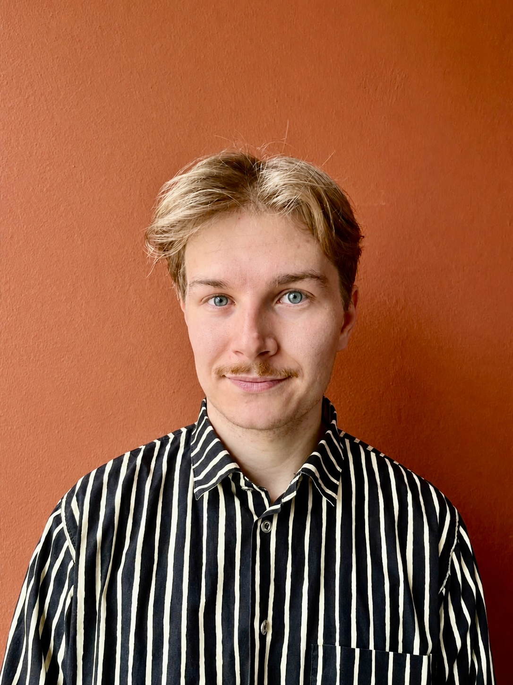

{width=200px}

PhD Student, Tampere University, affiliated with Finnish Centre of Excellence
in Tax Systems Research (FIT) and Education for the Future Flagship (EDUCA)

I am 3rd year PhD student from University of Tampere under supervision of
[prof. Jarkko Harju](https://sites.google.com/view/jarkkoharju/home) and
[assistant prof. Vesa-Matti Heikkuri](https://www.tuni.fi/en/people/vesa-matti-heikkuri).
During the 2026-2027 academic year I am visiting
[Opportunity Insights](https://opportunityinsights.org/) at Harvard University
and my host is [prof. Raj Chetty](https://rajchetty.com/).

## CV

[Download CV (PDF)](cv.pdf)
